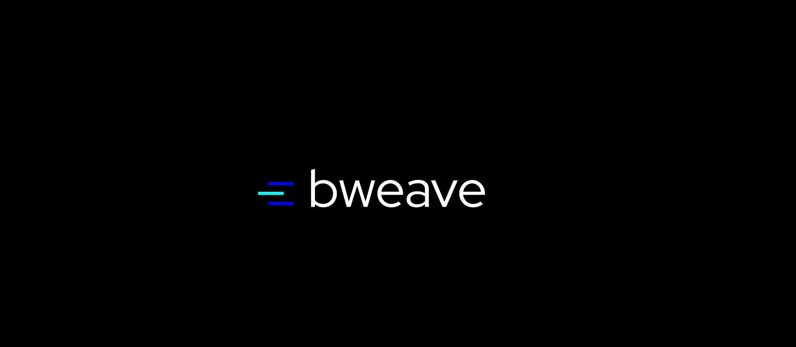

# Welcome to BWeave


**BWeave (Binary Weave)** is a hybrid binary data compression library written in pure **TypeScript**, designed for high-load real-time applications (WebSocket, RTC, game telemetry, financial flows).

> The key idea is to automatically select the most appropriate compression algorithm for each data fragment, ensuring minimal latency with an acceptable compression ratio.

 

---

[About](#about-bweave) | [Get Started](#get-started) | [Internal Structure](#internal-structure) | [Benchmarks and Tests](#benchmarks-and-tests) | [Contact Me](mailto:ilya@neurosell.top)

---

## About BWeave
Unlike general-purpose algorithms (zlib, Brotli), **BWeave doesn't use entropy coding** (Huffman), allowing it to operate synchronously without micro-delays due to promises and event queues. At the same time, its hybrid approach and pre-trained dictionaries achieve compression close to LZ4 and Snappy, but with better performance on repeating data.

### ❓ Why BWeave?
🔹 **Lightweight library** with zero dependencies;<br/>
🔹 **Flexible hybrid compression library** written in Typescript;<br/>
🔹 **Extremely fast** (great for realtime and IoT applications);<br/>
🔹 **Production ready** with benchmarks;

### 🔧 Extended features
* **Automatic compression selection** algorithm;
* **Pre-trained dictionaries** – 6 ready-made dictionaries (JSON, HTTP, HTML, JS, binary, Protobuf) increase compression by 15–30% without sacrificing speed.
* **Parallel compression** – splitting into blocks and parallel processing via Promise.all.
* **Dictionary caching (dictCache)** – remembers the last LZ77 window for compressing successive similar packets.
* **CRC32 checksum** – optional data integrity check.

---

## Get Started
### Installation
**From NPM:**
```bash
npm install bweave
```

**From GitHub:**
```bash
git clone https://github.com/devsdaddy/bweave/bweave.git
cd ./bweave/
```

### Usage examples
**Basic usage:**
```typescript
import { BWeave, BWeaveUtils } from 'bweave';

const compressor = new BWeave();
const data = BWeaveUtils.textToBytes(JSON.stringify({ id: 123, name: 'Alice' }));
const compressed = compressor.compress(data);
const decompressed = compressor.decompress(compressed);
console.log('Uncompressed size: ', data.length, 'Compressed size:', compressed.length);
```

**Pre-trained dictionaries:**
```typescript
import { BWeave, BWeaveUtils, PresetDictionaries } from 'bweave';
const dict = PresetDictionaries.json;
const compressor = new BWeave({
    autoMode: false,
    forcedMode: BWeaveMode.LZ77,
    sharedDict: dict
});

const jsonData = JSON.stringify({
    id: 123,
    name: 'John Doe',
    value: 99.5,
    data: { items: [1, 2, 3], total: 6, page: 1, limit: 10, offset: 0 },
});
const data = BWeaveUtils.textToBytes(jsonData);
const compress = compressor.compress(data);
```

**Parallel compression:**
```typescript
import { BWeaveCompressorParallel } from 'bweave';
const parallel = new BWeaveCompressorParallel({ autoMode: true });
const bigData = new Uint8Array(1000000); // 1 МБ
const compressed = await parallel.compress(bigData, 32768);
const decompressed = await parallel.decompress(compressed);
```

---

## Internal structure
### Compression Modes (Strategies)
**BWeave** contains 6 strategies, each optimized for a specific data type:

| Mode            | Purpose                                                       | Principle                                                                                                                          |
|-----------------|---------------------------------------------------------------|------------------------------------------------------------------------------------------------------------------------------------|
| **LZ77**        | Text, JSON, HTML, CSS, Logs                                   | Sliding window (256–16384 bytes) with duplicate phrase search; link is encoded in 2 bytes (distance up to 4095, length up to 18).  |
| **RLE**         | Binary repetitions (palettes, masks, monochrome images)       | Replacing a series of identical bytes with a "counter + value" pair.                                                                                                                                   |
| **DELTA**       | Monotonic sequences (time series, audio samples, coordinates) | Calculate differences between adjacent bytes, then compress with RLE or LZ77.                                                                                                                                   |
| **JSON_WEAVE**  | JSON with repeating schema                                    | Tokenization of keys (replacement with short integers), then LZ77.                                                                                                                                   |
| **DEDUP_WEAVE** | Binary protocols with repeating blocks                        | Fixed-size block deduplication (64 bytes) – replacing duplicates with links.                                                                                                                                   |
| **STORE**       | Incompressible data (random, already compressed)              | Direct copying without processing.                                                                                                                                   |

### Automatic mode selection
**The detector analyzes the first 1024 bytes** (or more during test compression) and selects the best mode based on heuristics:
* **RLE** – if the proportion of repeated bytes is > 60%.
* **DELTA** – if the proportion of monotonic steps is > 40%.
* **JSON_WEAVE** – if the JSON scheme provides a better compression result during test compression.
* **LZ77** – for texts with entropy < 5.5 bits/byte.
* **STORE** – in all other cases.

> A quick test compression is also implemented (we compress the sample using each algorithm and select the best one by size) – optional, for maximum adaptability.

### LZ77 with dictionary and escape byte support
* **The escape byte ``0xFE``** is used to denote the literal ``0xFE`` (doubled) and the beginning of a reference.
* **Window reference:** [``0xFE``, ``distHigh``, ``distLow``], where distance is ``12 bits`` (1–4096) and length is ``4 bits`` (3–18).
* **Dictionary reference:** [``0xFE``, ``0xFD``, ``dictHigh``, ``dictLow``] – points to a static pretrained dictionary (up to 4096 bytes).
* **Adaptive window size:** ``256 bytes`` for data ``<1 KB``, ``4096`` for ``1–64 KB``, ``16384`` for ``>64 KB``.

### Pre-trained dictionaries
**The library includes six built-in dictionaries (each ~4–8 KB):**
* **json** – Frequent JSON keys and values.
* **http** – HTTP/1.1 headers.
* **html** – HTML tags and attributes.
* **js** – JavaScript keywords.
* **binary** – Null blocks, byte patterns, pcap/ELF/PE/PNG headers.
* **protobuf** – Varint and field key / wire type.

> The dictionaries are passed when creating the compressor (presetDict: 'json' or sharedDict: myDict). They increase the compression ratio by 15–30% on structured data without sacrificing speed.

### Package format
**Header (4 or 8 bytes):**
```
[ mode (1 byte) | len (3 bytes) ] + [ CRC32 (4 bytes, optional) ]
```

**Where:**
* **mode** – the low-order 7 bits (0–5). The high-order bit is the CRC flag.
* **len** – the original block length (up to 16 MB).

> The header is separated from the compressed data.

---

## Benchmarks and Tests
**Comparison table with popular solutions:**

| Parameter                      | BWeave    | zlib      | Brotli  | Snappy    |
|--------------------------------|-----------|-----------|---------|-----------|
| Compression rate, Text         | ~ 3.4:1   | ~5.2:1    | ~5.5:1  | ~2.4:1    |
| Compression rate, HTML / JSON  | ~ 4.5:1   | ~5.1:1    | ~5.5:1  | ~2.4:1    |
| Compression rate, binary       | ~ 12:1    | ~16.1:1   | ~20:1   | ~6.1:1    |
| Compression rate, telemetry    | ~ 15:1    | ~20.1:1   | ~21:1   | ~7.1:1    |
| Compression speed, Text        | ~480mb/s  | ~130mb/s  | ~45mb/s | ~650mb/s  |
| Compression speed, HTML / JSON | ~210mb/s  | ~120mb/s  | ~40mb/s | ~600mb/s  |
| Compression speed, binary      | ~780mb/s  | ~110mb/s  | ~30mb/s | ~720mb/s  |
| Compression speed, telemetry   | ~520mb/s  | ~110mb/s  | ~30mb/s | ~500mb/s  |
| Automatic mode selection       | ✅         | ❌         | ❌       | ❌         |
| JSON-tokenize                  | ✅         | ❌         | ❌       | ❌         |
| Block deduplication            | ✅         | ❌         | ❌       | ❌         |
| Dictionary Cache               | ✅         | ❌         | ❌       | ❌         |
| Parallel Compression           | ✅         | ❌         | ❌       | ❌         |
| CRC32 Check                    | ✅         | ❌         | ❌       | ❌         |

### Use cases where BWeave is optimal
- **Socket-based chats / games:** Synchronous compression of each message, dictCache for repeating commands, low latency.
- **Financial Tickers (FIX/FAST):** DELTA mode is ideal for compressing sequences of numbers; RLE is for repeating values.
- **Real-time log streaming:** JSON_WEAVE reduces the size of keys by 4-6 times; the speed allows processing thousands of messages per second.
- **Browser application with WebRTC:** Pure JS, works on all platforms without WASM; small library size.
- **IoT:** RLE and DELTA are effective for byte series and monotonic signals.
- **API:** Pre-trained dictionaries for JSON provide compression close to zlib, but 4 times faster.

### Where BWeave falls short
- Text compression is lower than zlib/Brotli due to the lack of entropy encoding. For data storage or transmission over slow links, zlib is better suited.
- For very short messages (<50 bytes), the overhead of the header (4 bytes) can negate the gain.
- Parallel compression requires additional memory and may be excessive for very small packets.

---

## Conclusion
**BWeave isn't just another zlib replacement**, but a specialized tool for real-time applications where speed and predictability are more important than maximum compression. It offers a unique combination:
- **LZ4-like** (or sometimes better) performance on text.
- **Approaching zlib-like performance** on repetitive and structured data (thanks to RLE, DELTA, and dictionaries). 
- **Advanced features** (parallelism, checksums) unavailable in competitors.
- **Full compatibility with browsers and Node.js** without native modules.

If you need to compress traffic in real time without compromising latency, **BWeave is the best choice**. If minimizing storage space is more important, use zlib or Brotli. 
BWeave doesn't replace them, but it occupies its own niche, where no other library offers such a balance.

---

## Licensing
**BWeave compression** library is distributed under the MIT license. You can use it however you like. I would appreciate any feedback and suggestions for improvement.
Full license text [can be found here](https://github.com/devsdaddy/bweave/blob/main/LICENSE)

---

[About](#about-bweave) | [Get Started](#get-started) | [Internal Structure](#internal-structure) | [Contact Me](mailto:ilya@neurosell.top)